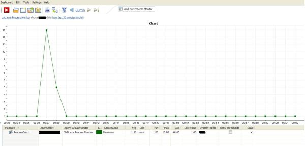

# Windows Process Monitor Plugin

## Overview

The plugin is querying the specified process on the given host(s) using the Windows tasklist command.  
The tasklist command allows a user to get information on applications and services with their process ID for all tasks running on a server. The plugin formats its output to return the count.

## Plugin Details

| Name | Windows Process Monitor Plugin
| :--- | :---
| Author | Derek Abing
| License | [dynaTrace BSD](dynaTraceBSD.txt)
| Support | [Not Supported ](https://community.compuwareapm.com/community/display/DL/Support+Levels#SupportLevels-Community)  
| Release History | 2012-03-05 Initial Release
| Download | [Windows Process Monitor Plugin 1.0.0](com.dynatrace.diagnostics.plugins.WindowsProcessStatusPlugin_1.0.0.jar) 

## Provided Measures

  * **ProcessCount**: Returns count of running processes matching the configured identifier. 

## Configuration

| Name | Value
| :--- | :---
| Process | The identifier of the process to monitor. (the filename, e.g. java.exe)

Since the plugin is using the tasklist command, this means that the logon account configured for the dynaTrace collector needs to have appropriate access to the host(s) you want to monitor (typically
Administrator access to the server). A good way to test this is to log into the collector with the account it is running as, open a command prompt and execute a tasklist command to the remote server
you want to monitor.

## Installation

Import the Plugin into the dynaTrace Server. For details how to do this please refer to the [dynaTrace
documentation](https://community.compuwareapm.com/community/display/DOCDT61/Plugin+Management).

